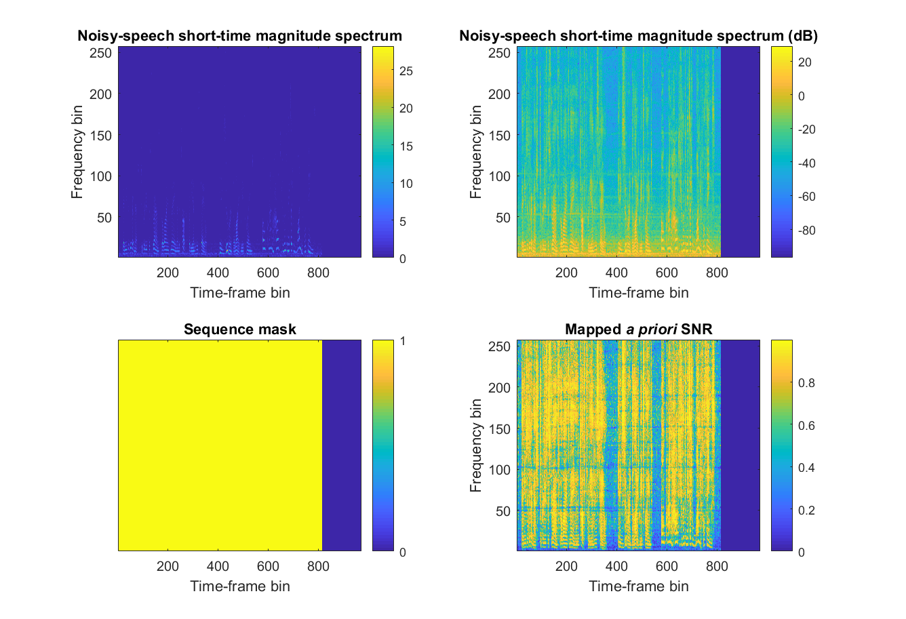
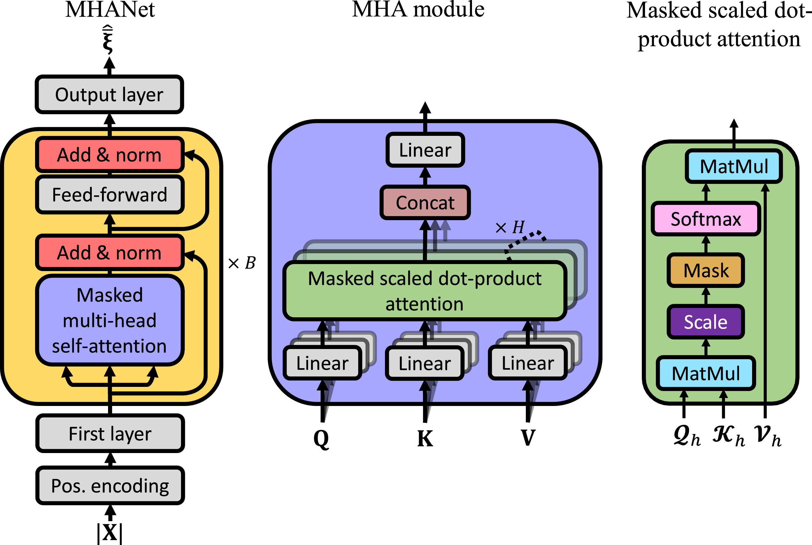

<!--

export PATH=/usr/local/cuda-10.1/bin${PATH:+:${PATH}}
export LD_LIBRARY_PATH=/usr/local/cuda-10.1/lib64${LD_LIBRARY_PATH:+:${LD_LIBRARY_PATH}}

-->

**Deep Xi**: A Deep Learning Approach to *A Priori* SNR Estimation for speech enhancement.
====

News
----

New trained model:
 * A trained MHANet is available in the `model` directory.

New journal paper:
 * [Masked Multi-Head Self-Attention for Causal Speech Enhancement](https://www.sciencedirect.com/science/article/pii/S0167639320302806)

New journal paper:
 * [Spectral distortion level resulting in a just-noticeable difference between an *a priori* signal-to-noise ratio estimate and its instantaneous case](https://doi.org/10.1121/10.0002113)

New preprint (under review):

 * [On Training Targets for Deep Learning Approaches to Clean Speech Magnitude Spectrum Estimation](https://www.techrxiv.org/articles/preprint/On_Training_Targets_for_Deep_Learning_Approaches_to_Clean_Speech_Magnitude_Spectrum_Estimation/13012760/2)
 * The code for this study can be found at: [https://github.com/anicolson/tgt_20](https://github.com/anicolson/tgt_20).

Contents
----
  * [Introduction](#introduction)
  * [How does Deep Xi work?](#how-does-deep-xi-work)
  * [Current networks](#current-networks)
  * [Available models](#available-models)
  * [Results](#results)
  * [DeepMMSE](#deepmmse)
  * [Installation](#installation)
  * [How to use Deep Xi](#how-to-use-deep-xi)
  * [Current issues and potential areas of improvement](#current-issues-and-potential-areas-of-improvement)
  * [Where can I get a dataset for Deep Xi?](#where-can-i-get-a-dataset-for-deep-xi)
  * [Which audio do I use with Deep Xi?](#which-audio-do-i-use-with-deep-xi)
  * [Citation guide](#citation-guide)

Introduction
----
**Deep Xi is implemented in TensorFlow 2/Keras and can be used for speech enhancement, noise estimation, mask estimation, and as a front-end for robust ASR.** [Deep Xi](https://doi.org/10.1016/j.specom.2019.06.002) (where the Greek letter 'xi' or ξ is pronounced  /zaɪ/ and is the symbol used in the literature for the *a priori* SNR) is a deep learning approach to *a priori* SNR estimation that was proposed in [[1]](https://doi.org/10.1016/j.specom.2019.06.002). Some of its use cases include:
* Minimum mean-square error (MMSE) approaches to **speech enhancement**.
* MMSE-based **noise PSD estimators**, as in *DeepMMSE* [[2]](https://ieeexplore.ieee.org/document/9066933).
* Ideal binary mask (IBM) estimation for **missing feature approaches**.
* Ideal ratio mask (IRM) estimation for **source separation**.
* **Front-end for robust ASR**

<!--

||
|----|
| <p align="center"> <b>Figure 1:</b> Deep Xi used as a front-end for robust ASR. The back-end (Deep Speech) is available <a href="https://github.com/mozilla/DeepSpeech">here</a>. The noisy speech magnitude spectrogram, as shown in <b>(a)</b>, is a mixture of clean speech with <i>voice babble</i> noise at an SNR level of -5 dB, and is the input to Deep Xi. Deep Xi estimates the <i>a priori</i> SNR, as shown in <b>(b)</b>. The <i>a priori</i> SNR estimate is used to compute an MMSE approach gain function, which is multiplied elementwise with the noisy speech magnitude spectrum to produce the clean speech magnitude spectrum estimate, as shown in <b>(c)</b>. <a href="https://github.com/anicolson/matlab_feat">MFCCs</a> are computed from the estimated clean speech magnitude spectrogram, producing the estimated clean speech cepstrogram, as shown in <b>(d)</b>. The back-end system, Deep Speech, computes the hypothesis transcript, from the estimated clean speech cepstrogram, as shown in <b>(e)</b>. </p> |

-->

How does Deep Xi work?
----
A training example is shown in **Figure 2**. A deep neural network (DNN) within the Deep Xi framework is fed the **noisy-speech short-time magnitude spectrum** as input. The training target of the DNN is a mapped version of the instantaneous *a priori* SNR (i.e. **mapped *a priori* SNR**). The instantaneous *a priori* SNR is mapped to the interval `[0,1]` to improve the rate of convergence of the used stochastic gradient descent algorithm. The map is the cumulative distribution function (CDF) of the instantaneous *a priori* SNR, as given by Equation (13) in [[1]](https://doi.org/10.1016/j.specom.2019.06.002). The statistics for the CDF are computed over a sample of the training set. An example of the mean and standard deviation of the sample for each frequency bin is shown in **Figure 3**. The training examples in each mini-batch are padded to the longest sequence length in the mini-batch. The **sequence mask** is used by TensorFlow to ensure that the DNN is not trained on the padding. During inference, the *a priori* SNR estimate is computed from the mapped *a priori* SNR using the sample statistics and Equation (12) from [[2]](https://ieeexplore.ieee.org/document/9066933).

||
|----|
| <p align="center"> <b>Figure 2:</b> <a>A training example for Deep Xi. Generated using `eval_example.m`.</a> </p> |

 ||
|----|
| <p align="center"> <b>Figure 3:</b> <a>The normal distribution for each frequency bin is computed from the mean and standard deviation of the instantaneous *a priori* SNR (dB) over a sample of the training set. Generated using `eval_stats.m`</a> </p> |

Current networks
-----

Configurations for the following networks can be found in [`run.sh`.](https://github.com/anicolson/DeepXi/blob/master/run.sh)

* **MHANet**: Multi-head attention network [6].
* **RDLNet**: Residual-dense lattice network [3].
* **ResNet**: Residual network [2].
* **ResLSTM & ResBiLSTM**: Residual long short-term memory (LSTM) network and residual bidirectional LSTM (ResBiLSTM) network [1].


Deep Xi utilising the MHANet (**Deep Xi-MHANet**) was proposed in [[6]](https://doi.org/10.1016/j.specom.2020.10.004). It utilises multi-head attention to efficiently model the long-range dependencies of noisy speech. Deep Xi-MHANet is shown in **Figure 4**. Deep Xi utilising a ResNet TCN (**Deep Xi-ResNet**) was proposed in [[2]](https://ieeexplore.ieee.org/document/9066933). It uses bottleneck residual blocks and a cyclic dilation rate. The network comprises of approximately 2 million parameters and has a contextual field of approximately 8 seconds. Deep Xi utilising a ResLSTM network (**Deep Xi-ResLSTM**) was proposed in [[1]](https://doi.org/10.1016/j.specom.2019.06.002). Each of its residual blocks contain a single LSTM cell. The network comprises of approximately 10 million parameters.

||
|----|
| <p align="center"> <b>Figure 4:</b> <a> <b>(left)</b> Deep Xi-MHANet from [6].</a></p> |

Available models
-----

**[`mhanet-1.1c`](https://github.com/anicolson/DeepXi/blob/master/run.sh) (available in the [`model`](https://github.com/anicolson/DeepXi/tree/master/model) directory)**

**[`resnet-1.1n`](https://github.com/anicolson/DeepXi/blob/master/run.sh) (available in the [`model`](https://github.com/anicolson/DeepXi/tree/master/model) directory)**

**[`resnet-1.1c`](https://github.com/anicolson/DeepXi/blob/master/run.sh) (available in the [`model`](https://github.com/anicolson/DeepXi/tree/master/model) directory)**

**Each available model is trained using the [Deep Xi dataset](https://ieee-dataport.org/open-access/deep-xi-dataset). Please see [`run.sh`](https://github.com/anicolson/DeepXi/blob/master/run.sh) for more details about these networks.**

There are multiple Deep Xi versions, comprising of different networks and restrictions. An example of the `ver` naming convention is `resnet-1.0c`. The network type is given at the start of `ver`. Versions with **c** are **causal**. Versions with **n** are **non-causal**.  The version iteration is also given, i.e. `1.0`.

Results
-----

Note: Results for the Deep Xi framework in this repository are reported for Tensorflow 2/Keras. Results in the papers were found using Tensorflow 1. All future work will be completed in Tensorflow 2/Keras.

**DEMAND Voice Bank test set**

Objective scores obtained on the DEMAND Voicebank test set described [here](http://ssw9.talp.cat/papers/ssw9_PS2-4_Valentini-Botinhao.pdf). **Each Deep Xi model is trained on the  DEMAND Voicebank training set**. As in previous works, the objective scores are averaged over all tested conditions. **CSIG**, **CBAK**, and **COVL** are mean opinion score (MOS) predictors of the signal distortion, background-noise intrusiveness, and overall signal quality, respectively. **PESQ** is the perceptual evaluation of speech quality measure. **STOI** is the short-time objective intelligibility measure (in \%). The highest scores attained for each measure are indicated in boldface.

| Method                 |   Gain | Causal | CSIG | CBAK | COVL | PESQ | STOI      | SegSNR |
|-------------------------|---|--------|------|------|------|------|-----------|----|
| Noisy speech              | -- | --     | 3.35 | 2.44 | 2.63 | 1.97 | 92 (91.5) | -- |
| [Wiener](https://ieeexplore.ieee.org/stamp/stamp.jsp?tp=&arnumber=543199) |  | Yes    | 3.23 | 2.68 | 2.67 | 2.22 | --        | -- |
| [SEGAN](https://arxiv.org/pdf/1703.09452.pdf)                |   --   | No     | 3.48 | 2.94 | 2.80 | 2.16 | 93  | -- |
| [WaveNet](https://arxiv.org/pdf/1706.07162.pdf)              | --     | No     | 3.62 | 3.23 | 2.98 | --   | --        | --|
| [MMSE-GAN](https://ieeexplore.ieee.org/stamp/stamp.jsp?tp=&arnumber=8462068)    |    --         | No     | 3.80 | 3.12 | 3.14 | 2.53 | 93      | -- |
| [Deep Feature Loss](https://arxiv.org/pdf/1806.10522.pdf)  |  --      | Yes    | 3.86 | 3.33 | 3.22 | --   | --        | -- |
| [Metric-GAN](https://arxiv.org/pdf/1905.04874.pdf) |      --          | No     | 3.99 | 3.18 | 3.42 | 2.86 | --        | -- |
| [Koizumi2020](https://doi.org/10.1109/icassp40776.2020.9053214)  |  -- | No  | 4.15 | 3.42 | 3.57 | 2.99 | --  | --  |
| [T-GSA](https://ieeexplore.ieee.org/document/9053591)   | --  | No | 4.18  | **3.59** | 3.62  | **3.06**  |  -- | --  |
| **Deep Xi-ResLSTM (1.0c)** | MMSE-LSA | Yes    | 4.01 | 3.25 | 3.34 | 2.65 | 91 (91.0) | 8.2 |
| **Deep Xi-ResNet (1.0c)** | MMSE-LSA | Yes    | 4.14 | 3.32 | 3.46 | 2.77 | 93 (93.2) | -- |
| **Deep Xi-ResNet (1.0n)** | MMSE-LSA | No    | 4.28 | 3.46 | 3.64 | 2.95 | 94 (93.6) | -- |
| **Deep Xi-ResNet (1.1c)** | MMSE-LSA | Yes    | 4.24 | 3.40 | 3.59 | 2.91 | 94 (93.5) | 8.4 |
| **Deep Xi-ResNet (1.1n)** | MMSE-LSA | No    | **4.35** | 3.52 | **3.71** | 3.03 | **94 (94.1)** | **9.3** |
| **Deep Xi-MHANet (1.0c)** | MMSE-LSA | Yes    | 4.15 | 3.37 | 3.48 | 2.77 | 93 (93.2) | 8.9 |
| **Deep Xi-MHANet (1.1c)** | MMSE-LSA | Yes    | 4.34 | 3.49 | 3.69 | 2.99 | 94 (94.0) | 9.1 |

**Deep Xi Test Set**

Average objective scores obtained over the conditions in the test set of the [Deep Xi dataset](https://ieee-dataport.org/open-access/deep-xi-dataset). **Each Deep Xi model is trained on the test set of the Deep Xi dataet**. SNR levels between -10 dB and 20 dB are considered only. **Results for each condition can be found in `log/results`**

| Method           | Gain      | Causal | CSIG | CBAK | COVL | PESQ | STOI      |
|-------------------------|---|--------|------|------|------|------|-----------|
| Deep Xi-ResNet (1.1c) | MMSE-STSA | Yes    |   3.14| 2.52| 2.43| 1.82| 84.85 |
| Deep Xi-ResNet (1.1c) | MMSE-LSA  | Yes    |   3.15| 2.55| 2.46| 1.85| 84.72 |
| Deep Xi-ResNet (1.1c) | SRWF/IRM  | Yes    |   3.12| 2.50| 2.41| 1.79| 84.95 |
| Deep Xi-ResNet (1.1c) | cWF       | Yes    |   3.15| 2.51| 2.44| 1.83| 84.94 |
| Deep Xi-ResNet (1.1c) | WF        | Yes    |  2.66| 2.46| 2.12| 1.69| 83.02 |
| Deep Xi-ResNet (1.1c) | IBM       | Yes    |   1.36| 2.16| 1.26| 1.30| 77.57 |
| Deep Xi-ResNet (1.1n) | MMSE-LSA  | No     | 3.30| 2.62| 2.59| 1.97| 86.70 |
| Deep Xi-MHANet (1.1c) | MMSE-LSA  | Yes    | **3.45**| **2.75**| **2.73**| **2.08** | **87.11** |

DeepMMSE
----

DeepMMSE: A Deep Learning Approach to MMSE-Based Noise Power Spectral Density Estimation.

To save noise PSD estimate `.mat` files from DeepMMSE, please use the following:
```
./run.sh VER="mhanet-1.1c" INFER=1 GAIN="deepmmse"
```

Installation
-----

Prerequisites for GPU usage:

* [CUDA 10.1](https://developer.nvidia.com/cuda-downloads)
* [cuDNN (>= 7.6)](https://developer.nvidia.com/cudnn)

To install:

1. `git clone https://github.com/anicolson/DeepXi.git`
2. `python3 -m venv --system-site-packages ~/venv/DeepXi`
3. `source ~/venv/DeepXi/bin/activate`
4. `cd DeepXi`
5. `pip install -r requirements.txt`

How to use Deep Xi
-----

Use [`run.sh`](https://github.com/anicolson/DeepXi/blob/master/run.sh) to configure and run Deep Xi. Look at [`config.sh`](https://github.com/anicolson/DeepXi/blob/master/config.sh) to set the paths to the dataset, models, and outputs.

**Inference:**
To perform inference and save the outputs, use the following:
```
./run.sh VER="mhanet-1.1c" INFER=1 GAIN="mmse-lsa"
```
Please look in [`thoth/args.py`](https://github.com/anicolson/DeepXi/blob/master/deepxi/args.py) for available gain functions and [`run.sh`](https://github.com/anicolson/DeepXi/blob/master/run.sh) for further options.

**Testing:**
To perform testing and get objective scores, use the following:
```
./run.sh VER="mhanet-1.1c" TEST=1 GAIN="mmse-lsa"
```
Please look in [`log/results`](https://github.com/anicolson/DeepXi/blob/master/log/results) for the results.

**Training:**
```
./run.sh VER="mhanet-1.1c" TRAIN=1
```
Ensure to delete the data directory before training. This will allow training lists and statistics for your training set to be saved and used. **To retrain from a certain epoch, set `--resume_epoch` in [`run.sh`](https://github.com/anicolson/DeepXi/blob/master/run.sh) to the desired epoch**.

Current issues and potential areas of improvement
-----

If you would like to contribute to Deep Xi, please investigate the following and compare it to current models:

* Currently, the ResLSTM network is not performing as well as expected (when compared to TensorFlow 1.x performance).


Where can I get a dataset for Deep Xi?
----
Open-source training and testing sets are available for Deep Xi on IEEE *DataPort*:

[4] Deep Xi dataset (training, validation, and test set): [http://dx.doi.org/10.21227/3adt-pb04](http://dx.doi.org/10.21227/3adt-pb04).

[5] Test set from the original [Deep Xi paper](https://doi.org/10.1016/j.specom.2019.06.002): [http://dx.doi.org/10.21227/0ppr-yy46](http://dx.doi.org/10.21227/0ppr-yy46).

The MATLAB scripts used to generate these sets can be found in [`set`](https://github.com/anicolson/DeepXi/tree/master/set).

Which audio do I use with Deep Xi?
----
Deep Xi operates on mono/single-channel audio (not stereo/dual-channel audio). Single-channel audio is used due to most cell phones using a single microphone. The available trained models operate on a sampling frequency of `f_s=16000`Hz, which is currently the standard sampling frequency used in the speech enhancement community. The sampling frequency can be changed in `run.sh`. Deep Xi can be trained using a higher sampling frequency (e.g. `f_s=44100`Hz), but this is unnecessary as human speech rarely exceeds 8 kHz (the Nyquist frequency of `f_s=16000`Hz is 8 kHz). The available trained models operate on a window duration and shift of `T_d=32`ms and `T_s=16`ms, respectively. To train a model on a different window duration and shift, `T_d` and `T_s` can be changed in `run.sh`. Currently, Deep Xi supports `.wav`, `.mp3`, and `.flac` audio codecs. The audio codec and bit rate does not affect the performance of Deep Xi.

Naming convention in the `set/` directory
-----

The following is already configured in the [Deep Xi dataset](http://dx.doi.org/10.21227/3adt-pb04).

**Training set**

The filenames of the waveforms in the `train_clean_speech` and `train_noise` directories are not restricted. There can be a different number of waveforms in each. The Deep Xi framework utilises each of the waveforms in `train_clean_speech` once during an epoch. For each `train_clean_speech` waveform of a mini-batch, the Deep Xi framework selects a random section of a randomely selected waveform from `train_noise` (that is at a length greater than or equal to the `train_clean_speech` waveform) and adds it to the `train_clean_speech` waveform at a randomly selected SNR level (the SNR level range can be set in `run.sh`).

**Validation set**

As the validation set must not change from epoch to epoch, a set of restrictions apply to the waveforms in `val_clean_speech` and `val_noise`. There must be the same amount of waveforms in `val_clean_speech` and `val_noise`. One waveform in `val_clean_speech` corresponds to only one waveform in `val_noise`, i.e. a clean speech and noise validation waveform pair. Each clean speech and noise validation waveform pair must have identical filenames and and an identical number of samples. Each clean speech and noise validation waveform pair must have the SNR level (dB) that they are to be mixed at placed at the end of their filenames. The convention used is `_XdB`, where `X` is replaced with the desired SNR level. E.g. `val_clean_speech/NAME_-5dB.wav` and `val_noise/NAME_-5dB.wav`. An example of the filenames for a clean speech and noise validation waveform pair is as follows: `val_clean_speech/198_19-198-0003_Machinery17_15dB.wav` and `val_noise/198_19-198-0003_Machinery17_15dB.wav`.

**Test set**

The filenames of the waveforms in the `test_noisy_speech` directory are not restricted. This is all that is required if you want inference outputs from Deep Xi, i.e. `./run.sh VER="ANY_NAME" INFER=1`. If you are obtaining objective scores by using `./run.sh VER="ANY_NAME" TEST=1`, then reference waveforms for the objective measures need to be placed in `test_clean_speech`. The waveforms in `test_clean_speech` and `test_noisy_speech` that correspond to each other must have the same number of samples (i.e. the same sequence length). The filename of the waveform in `test_clean_speech` that corresponds to a waveform in `test_noisy_speech` must be contained in the corresponding test noisy speech waveforn filename. E.g. if the filename of a test noisy speech waveform is `test_noisy_speech/61-70968-0000_SIGNAL021_-5dB.wav`, then the filename of the corresponding test clean speech waveform must be contained in the filename of the test noisy speech waveform: `test_clean_speech/61-70968-0000.wav`. This is because a test clean speech waveform may be used as a reference for multiple waveforms in `test_noisy_speech` (e.g. `test_noisy_speech/61-70968-0000_SIGNAL021_0dB.wav`, `test_noisy_speech/61-70968-0000_SIGNAL021_5dB.wav`, and `test_noisy_speech/61-70968-0000_SIGNAL021_10dB.wav` are additional test noisy speech waveforms that the test clean speech waveform from the previous example is a reference for).

Citation guide
-----

Please cite the following depending on what you are using:
* The Deep Xi framework is proposed in [1].
* If using Deep Xi-MHANet, please cite [1] and [6].
* If using Deep Xi-ResLSTM, please cite [1].
* If using Deep Xi-ResNet, please cite [1] and [2].
* If using DeepMMSE, please cite [2].
* If using Deep Xi-RDLNet, please cite [1] and [3].
* If using Deep Xi dataset, please cite [4].
* If using the Test Set From 10.1016/j.specom.2019.06.002, please cite [5].

[1] [A. Nicolson, K. K. Paliwal, Deep learning for minimum mean-square error approaches to speech enhancement, Speech Communication 111 (2019) 44 - 55, https://doi.org/10.1016/j.specom.2019.06.002.](https://doi.org/10.1016/j.specom.2019.06.002)

[2] [Q. Zhang, A. M. Nicolson, M. Wang, K. Paliwal and C. Wang, "DeepMMSE: A Deep Learning Approach to MMSE-based Noise Power Spectral Density Estimation," in IEEE/ACM Transactions on Audio, Speech, and Language Processing, vol. 28, pp. 1404-1415, 2020, doi: 10.1109/TASLP.2020.2987441.](https://ieeexplore.ieee.org/document/9066933)

[3] [Mohammad Nikzad, Aaron Nicolson, Yongsheng Gao, Jun Zhou, Kuldip K. Paliwal, and Fanhua Shang. "Deep residual-dense lattice network for speech enhancement". In AAAI Conference on Artificial Intelligence, pages 8552–8559, 2020](https://www.aaai.org/Papers/AAAI/2020GB/AAAI-NikzadM.6844.pdf)

[4] Aaron Nicolson, "Deep Xi dataset", IEEE Dataport, 2020. [Online]. Available: http://dx.doi.org/10.21227/3adt-pb04.

[5] Aaron Nicolson, "Test Set From 10.1016/j.specom.2019.06.002", IEEE Dataport, 2020. [Online]. Available: http://dx.doi.org/10.21227/0ppr-yy46.

[6] [A. Nicolson, K. K. Paliwal, Masked multi-head self-attention for causal speech enhancement, Speech Communication 125 (2020) 80 - 96, https://doi.org/10.1016/j.specom.2019.06.002.](https://doi.org/10.1016/j.specom.2019.06.002)
