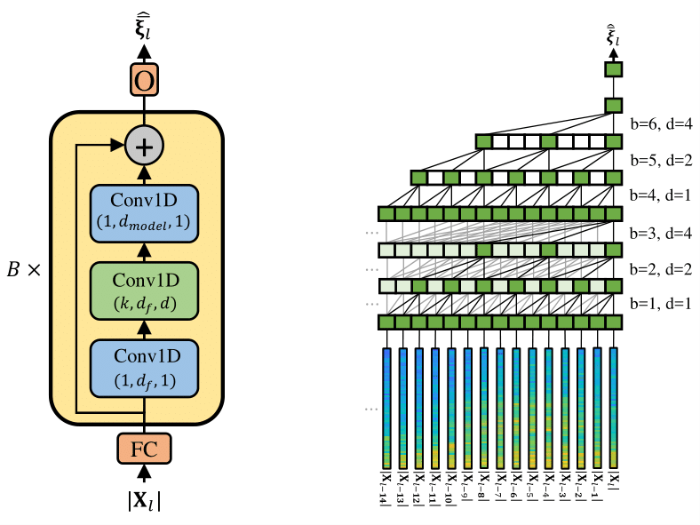

<!--

export PATH=/usr/local/cuda-10.1/bin${PATH:+:${PATH}}
export LD_LIBRARY_PATH=/usr/local/cuda-10.1/lib64${LD_LIBRARY_PATH:+:${LD_LIBRARY_PATH}}

-->

Deep Xi has been updated to TensorFlow 2!
====

Deep Xi: *A Deep Learning Approach to *A Priori* SNR Estimation.*
====

Deep Xi is implemented in TensorFlow 2 and is used for speech enhancement, noise estimation, for mask estimation, and as a front-end for robust ASR.
----
[Deep Xi](https://doi.org/10.1016/j.specom.2019.06.002) (where the Greek letter 'xi' or ξ is pronounced  /zaɪ/) is a deep learning approach to *a priori* SNR estimation that was proposed in [[1]](https://doi.org/10.1016/j.specom.2019.06.002) and is implemented in [TensorFlow 2](https://www.tensorflow.org/). Some of its use cases include:


* It can be used by minimum mean-square error (MMSE) approaches to **speech enhancement** like the MMSE short-time spectral amplitude (MMSE-STSA) estimator.
* It can be used by minimum mean-square error (MMSE) approaches to **noise estimation**, as in *DeepMMSE* [[2]](https://ieeexplore.ieee.org/document/9066933).
* Estimate the ideal binary mask **(IBM)** for missing feature approaches or the ideal ratio mask **(IRM)**.
* A **front-end for robust ASR**, as shown in **Figure 1**.

||
|----|
| <p align="center"> <b>Figure 1:</b> Deep Xi used as a front-end for robust ASR. The back-end (Deep Speech) is available <a href="https://github.com/mozilla/DeepSpeech">here</a>. The noisy speech magnitude spectrogram, as shown in <b>(a)</b>, is a mixture of clean speech with <i>voice babble</i> noise at an SNR level of -5 dB, and is the input to Deep Xi. Deep Xi estimates the <i>a priori</i> SNR, as shown in <b>(b)</b>. The <i>a priori</i> SNR estimate is used to compute an MMSE approach gain function, which is multiplied elementwise with the noisy speech magnitude spectrum to produce the clean speech magnitude spectrum estimate, as shown in <b>(c)</b>. <a href="https://github.com/anicolson/matlab_feat">MFCCs</a> are computed from the estimated clean speech magnitude spectrogram, producing the estimated clean speech cepstrogram, as shown in <b>(d)</b>. The back-end system, Deep Speech, computes the hypothesis transcript, from the estimated clean speech cepstrogram, as shown in <b>(e)</b>. </p> |


How does Deep Xi work?
----
A training example is shown in **Figure 2**. A deep neural network (DNN) within the Deep Xi framework is fed the **noisy-speech short-time magnitude spectrum** as input. The training target of the DNN is a mapped version of the instantaneous *a priori* SNR (i.e. **mapped *a priori* SNR**). The instantaneous *a priori* SNR is mapped to the interval `[0,1]` to improve the rate of convergence of the used stochastic gradient descent algorithm. The map is the cumulative distribution function (CDF) of the instantaneous *a priori* SNR, as given by Equation (13) in [[1]](https://doi.org/10.1016/j.specom.2019.06.002). The statistics for the CDF are computed over a sample of the training set. An example of the mean and standard deviation of the sample for each frequency bin is shown in **Figure 3**. The training examples in each mini-batch are padded to the longest sequence length in the mini-batch. The **sequence mask** is used by TensorFlow to ensure that the DNN is not trained on the padding. During inference, the *a priori* SNR estimate is computed from the mapped *a priori* SNR using the sample statistics and Equation (12) from [[2]](https://ieeexplore.ieee.org/document/9066933).

||
|----|
| <p align="center"> <b>Figure 2:</b> <a>A training example for Deep Xi. Generated using `eval_example.m`.</a> </p> |

 ||
|----|
| <p align="center"> <b>Figure 3:</b> <a>The normal distribution for each frequency bin is computed from the mean and standard deviation of the instantaneous *a priori* SNR (dB) over a sample of the training set. Generated using `eval_stats.m`</a> </p> |

Which audio do I use with Deep Xi?
----
Deep Xi operates on mono/single-channel audio (not stereo/dual-channel audio). Single-channel audio is used due to most cell phones using a single microphone. The available trained models operate on a sampling frequency of `f_s=16000`Hz, which is currently the standard sampling frequency used in the speech enhancement community. The sampling frequency can be changed in `run.sh`. Deep Xi can be trained using a higher sampling frequency (e.g. `f_s=44100`Hz), but this is unnecessary as human speech rarely exceeds 8 kHz (the Nyquist frequency of `f_s=16000`Hz is 8 kHz). The available trained models operate on a window duration and shift of `T_d=32`ms and `T_s=16`ms, respectively. To train a model on a different window duration and shift, `T_d` and `T_s` can be changed in `run.sh`. Currently, Deep Xi supports `.wav`, `.mp3`, and `.flac` audio codecs. The audio codec and bit rate does not affect the performance of Deep Xi.

Where can I get a dataset for Deep Xi?
----
Open-source training and testing sets are available for Deep Xi on IEEE *DataPort*:

Deep Xi Training Set: [http://dx.doi.org/10.21227/3adt-pb04](http://dx.doi.org/10.21227/3adt-pb04).

Deep Xi Test Set: [http://dx.doi.org/10.21227/h3xh-tm88](http://dx.doi.org/10.21227/h3xh-tm88).

Test set from the original [Deep Xi paper](https://doi.org/10.1016/j.specom.2019.06.002): [http://dx.doi.org/10.21227/0ppr-yy46](http://dx.doi.org/10.21227/0ppr-yy46).

The MATLAB scripts used to generate these sets can be found in [`set`](https://github.com/anicolson/DeepXi/tree/master/set).

Current networks
-----
Recurrent neural networks (RNNs) and temporal convolutional networks (TCNs), are available: <!-- and attention-based networks -->
<!--- * **MHANet**: Multi-head attention network. --->
* **ResNet**: Residual network.
* **ResLSTM**: Residual long short-term memory network.

<!--- Deep Xi utilising the MHANet (**Deep Xi-MHANet**) was proposed in . --->

Deep Xi utilising a ResNet TCN (**Deep Xi-ResNet**) was proposed in [[2]](https://ieeexplore.ieee.org/document/9066933). It uses bottleneck residual blocks and a cyclic dilation rate. The network comprises of approximately 2 million parameters and has a contextual field of approximately 8 seconds. An example of Deep Xi-ResNet is shown in **Figure 4**. **A trained model for version `resnet-1.0c` is available in the [`model`](https://github.com/anicolson/DeepXi/tree/master/model) directory. It is trained using the [Deep Xi Training Set](https://ieee-dataport.org/open-access/deep-xi-training-set).**

Deep Xi utilising a ResLSTM network (**Deep Xi-ResLSTM**) was proposed in [[1]](https://doi.org/10.1016/j.specom.2019.06.002). Each of its residual blocks contain a single LSTM cell. The network comprises of approximately 10 million parameters.

||
|----|
| <p align="center"> <b>Figure 4:</b> <a> <b>(left)</b> Deep Xi-ResNet with <i>B</i> bottlekneck blocks. Each block has a bottlekneck size of <i>d_f</i>, and an output size of <i>d_model</i>. The middle convolutional unit has a kernel size of <i>k</i> and a dilation rate of <i>d</i>. The input to the ResNet is the noisy speech magnitude spectrum for frame <i>l</i>.  The output is the corresponding mapped <i>a priori</i> SNR estimate for each component of the noisy speech magnitude spectrum. <b>(right)</b> An example of Deep Xi-ResNet with <i>B=6</i>, a kernel size of <i>k=3</i>, and a maximum dilation rate of <i>4</i>. The dilation rate increases with the block index, <i>b</i>, by a power of 2 and is cycled if the maximum dilation rate is exceeded.</a></p> |

Deep Xi Versions
-----
There are multiple Deep Xi versions, comprising of different networks and restrictions. An example of the `ver` naming convention is `resnet-1.0c`. The network type is given at the start of `ver`. Versions with **c** are **causal**. Versions with **n** are **non-causal**.  The version iteration is also given, i.e. `1.0`. Here are the current versions:

**`resnet-1.0c` (available in the [`model`](https://github.com/anicolson/DeepXi/tree/master/model) directory)**
```
d_model=256
n_blocks=40
d_f=64
k=3
max_d_rate=16
test_epoch=180
mbatch_size=8
causal=1
```

**`resnet-1.0n` (technically, this is not a TCN due to the use of non-causal dilated 1D kernels)**
```
d_model=256
n_blocks=40
d_f=64
k=3
max_d_rate=16
test_epoch=180
mbatch_size=8
causal=0
```

**`reslstm-1.0c`**
```
d_model=512  
n_blocks=5   
test_epoch=  
mbatch_size=8   
```


<!--
Trained models for **c2.7a** and **c1.13a** can be found in the *./model* directory. The trained model for **n1.9a** is to large to be stored on github. A model for **n1.9a** can be downloaded from [here](https://www.dropbox.com/s/wkhymfmx4qmqvg7/n1.5a.zip?dl=0).
-->

Results for Deep Xi Test Set
-----

Average objective scores obtained over the conditions in the [Deep Xi Test Set](http://dx.doi.org/10.21227/h3xh-tm88). SNR levels between -10 dB and 20 dB are considered only. **MOS-LQO** is the mean opinion score (MOS) objective listening quality score obtained using Wideband PESQ. **PESQ** is the perceptual evaluation of speech quality measure. **STOI** is the short-time objective intelligibility measure (in \%). **eSTOI** is extended STOI. **Results for each condition can be found in `log/results`**

| Method           | Gain      | Causal | MOS-LQO | PESQ | STOI | eSTOI |
|------------------|-----------|--------|---------|------|------|-------|
| Deep Xi-ResNet (resnet-1.0c) | MMSE-STSA | Yes    |   1.90|2.34|80.92|65.90|
| Deep Xi-ResNet (resnet-1.0c) | MMSE-LSA  | Yes    |   1.92|2.37|80.79|65.77|
| Deep Xi-ResNet (resnet-1.0c) | SRWF/IRM  | Yes    |   1.87|2.31|80.98|65.94|
| Deep Xi-ResNet (resnet-1.0c) | cWF       | Yes    |   1.92|2.34|81.11|65.79|
| Deep Xi-ResNet (resnet-1.0c) | WF        | Yes    |   1.75|2.21|78.30|63.96|
| Deep Xi-ResNet (resnet-1.0c) | IBM       | Yes    |   1.38|1.73|70.85|55.95|

Results for the DEMAND -- Voice Bank test set
-----
Objective scores obtained on the DEMAND--Voicebank test set described [here](http://ssw9.talp.cat/papers/ssw9_PS2-4_Valentini-Botinhao.pdf). As in previous works, the objective scores are averaged over all tested conditions. **CSIG**, **CBAK**, and **COVL** are mean opinion score (MOS) predictors of the signal distortion, background-noise intrusiveness, and overall signal quality, respectively. **PESQ** is the perceptual evaluation of speech quality measure. **STOI** is the short-time objective intelligibility measure (in \%). The highest scores attained for each measure are indicated in boldface.

| Method                     | Causal | CSIG | CBAK | COVL | PESQ | STOI      |
|----------------------------|--------|------|------|------|------|-----------|
| Noisy speech               | --     | 3.35 | 2.44 | 2.63 | 1.97 | 92 (91.5) |
| [Wiener](https://ieeexplore.ieee.org/stamp/stamp.jsp?tp=&arnumber=543199) | Yes    | 3.23 | 2.68 | 2.67 | 2.22 | --        |
| [SEGAN](https://arxiv.org/pdf/1703.09452.pdf)                      | No     | 3.48 | 2.94 | 2.80 | 2.16 | **93**        |
| [WaveNet](https://arxiv.org/pdf/1706.07162.pdf)                    | No     | 3.62 | 3.23 | 2.98 | --   | --        |
| [MMSE-GAN](https://ieeexplore.ieee.org/stamp/stamp.jsp?tp=&arnumber=8462068)                 | No     | 3.80 | 3.12 | 3.14 | 2.53 | **93**        |
| [Deep Feature Loss](https://arxiv.org/pdf/1806.10522.pdf)          | Yes    | 3.86 | **3.33** | 3.22 | --   | --        |
| [Metric-GAN](https://arxiv.org/pdf/1905.04874.pdf)                 | No     | 3.99 | 3.18 | 3.42 | **2.86** | --        |
| **Deep Xi-ResNet (3e, tf1 version) MMSE-LSA** | Yes    | **4.12** | **3.33** | **3.48** | 2.82 | **93 (93.3)** |
| **Deep Xi-ResNet (1.0c, causal) MMSE-LSA** | Yes    | **4.14** | **3.32** | **3.46** | 2.77 | **93 (93.2)** |
| **Deep Xi-ResNet (1.0n, non-causal) MMSE-LSA** | Yes    | **4.28** | **3.46** | **3.64** | 2.95 | **94 (93.6)** |

Installation
-----

Prerequisites for GPU usage:

* [CUDA 10.1](https://developer.nvidia.com/cuda-downloads)
* [cuDNN (>= 7.6)](https://developer.nvidia.com/cudnn)

To install:

1. `git clone https://github.com/anicolson/DeepXi.git`
2. `virtualenv --system-site-packages -p python3 ~/venv/DeepXi`
3. `source ~/venv/DeepXi/bin/activate`
4. `cd DeepXi`
5. `pip install -r requirements.txt`

How to Use the Deep Xi
-----

Use [`run.sh`](https://github.com/anicolson/DeepXi/blob/master/run.sh) to configure and run Deep Xi.

**Inference:**
To perform inference and save the outputs, use the following:
```
./run.sh VER="resnet-1.0c" INFER=1 GAIN="mmse-lsa"
```
Please look in [`thoth/args.py`](https://github.com/anicolson/DeepXi/blob/master/deepxi/args.py) for available gain functions and [`run.sh`](https://github.com/anicolson/DeepXi/blob/master/run.sh) for further options.

**Testing:**
To perform testing and get objective scores, use the following:
```
./run.sh VER="resnet-1.0c" TEST=1 GAIN="mmse-lsa"
```
Please look in [`log/results`](https://github.com/anicolson/DeepXi/blob/master/log/results) for the results.

**Training:**
```
./run.sh VER="resnet-1.0c" TRAIN=1 GAIN="mmse-lsa"
```
Ensure to delete the data directory before training. This will allow training lists and statistics for your training set to be saved and used. **To retrain from a certain epoch, set `--resume_epoch` in [`run.sh`](https://github.com/anicolson/DeepXi/blob/master/run.sh) to the desired epoch**.

Citation guide
-----
Please cite the following depending on what you are using:
* If using Deep Xi-ResLSTM, please cite [1].
* If using Deep Xi-ResNet, please cite [1] and [2].
* If using DeepMMSE, please cite [2].

[1] [A. Nicolson, K. K. Paliwal, Deep learning for minimum mean-square error approaches to speech enhancement, Speech Communication 111 (2019) 44 - 55, https://doi.org/10.1016/j.specom.2019.06.002.](https://doi.org/10.1016/j.specom.2019.06.002)

[2] [Q. Zhang, A. M. Nicolson, M. Wang, K. Paliwal and C. Wang, "DeepMMSE: A Deep Learning Approach to MMSE-based Noise Power Spectral Density Estimation," in IEEE/ACM Transactions on Audio, Speech, and Language Processing.](https://ieeexplore.ieee.org/document/9066933)
