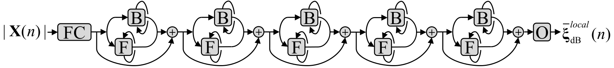

# DeepXi: Residual Bidirectional Long Short-Term Memory (ResBLSTM) Network *A Priori* SNR estimator
-----

DeepXi (where the Greek letter 'xi' or ξ is ponounced  /zaɪ/) is a residual bidirectional long short-term memory (ResBLSTM) network *a priori* SNR estimator that was proposed in [1]. It can be used by minimum mean-square error (MMSE) approaches like the MMSE short-time spectral amplitude (MMSE-STSA) estimator, the MMSE log-spectral amplitude (MMSE-LSA) estimator, and the Wiener filter (WF) approach. It can also be used to estimate the ideal ratio mask (IRM) and the ideal binary mask (IBM). DeepXi is implemented in [TensorFlow](https://www.tensorflow.org/) and is trained to estimate the *a priori* SNR for single channel noisy speech with a sampling frequency of 16 kHz. 

## Prerequisites
-----
* [TensorFlow](https://www.tensorflow.org/)
* [MATLAB](https://www.mathworks.com/products/matlab.html)

## Installation
-----

It is recommended to use a [virtual environment](http://virtualenvwrapper.readthedocs.io/en/latest/install.html).
-----
1. `git clone https://github.com/anicolson/DeepXi.git`
2. `pip install -r requirements.txt`
3. Install [pygpu](http://deeplearning.net/software/libgpuarray/installation.html)

## Download the Model
-----
A trained model can be downloaded from [here](https://www.dropbox.com/s/wkhymfmx4qmqvg7/n1.5a.zip?dl=0). Unzip and place in the *model* directory. The model was trained with a sampling rate of 16 kHz.

## How to Perform Speech Enhancement
-----
Simply run the script (python3 deepxi.py). Run the script in the virtual environment that TensorFlow is installed in. The script has different inference options, and is also able to perform training if required.

## Directory Description
-----
Directory | Description
--------| -----------  
lib | Functions for deepxi.py.
model | The directory for the model (the model must be [downloaded](https://www.dropbox.com/s/wkhymfmx4qmqvg7/n1.5a.zip?dl=0)).
noisy_speech | Noisy speech. Place noisy speech .wav files to be enhanced here.
output | DeepXi outputs, including the enhanced speech .wav output files.
stats | Statistics of a sample from the training set. The mean and standard deviation of the *a priori* SNR for the sample are used to compute the training target. 

## References
-----
[1] A. Nicolson and K. K. Paliwal, "Deep Learning For Minimum Mean-Square Error Approaches to Speech Enhancement", Submitted to Speech Communication.
