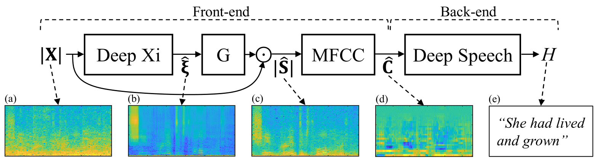
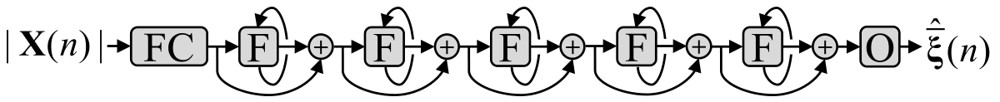
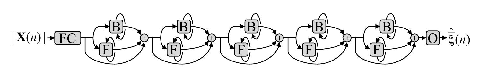

<!--- 

export PATH=/usr/local/cuda-10.0/bin${PATH:+:${PATH}}
export LD_LIBRARY_PATH=/usr/local/cuda-10.0/lib64${LD_LIBRARY_PATH:+:${LD_LIBRARY_PATH}}

-->

Deep Xi: *A Deep Learning Approach to *A Priori* SNR Estimation.* 
====

Deep Xi can be used for speech enhancement, for noise estimation, and as a front-end for robust ASR.
----
[Deep Xi](https://doi.org/10.1016/j.specom.2019.06.002) (where the Greek letter 'xi' or ξ is pronounced  /zaɪ/) is a deep learning approach to *a priori* SNR estimation that was proposed in [[1]](https://doi.org/10.1016/j.specom.2019.06.002) and is implemented in [TensorFlow](https://www.tensorflow.org/). Some of its use cases include:


* Minimum mean-square error (MMSE) approaches to **speech enhancement** like the MMSE short-time spectral amplitude (MMSE-STSA) estimator, the MMSE log-spectral amplitude (MMSE-LSA) estimator, and the Wiener filter (WF) approach.
* Estimate the ideal ratio mask **(IRM)** and the ideal binary mask **(IBM)**. 
* A **front-end for robust ASR**, as shown in **Figure 1**.

||
|----|
| <p align="center"> <b>Figure 1:</b> Deep Xi used as a front-end for robust ASR. The back-end (Deep Speech) is available <a href="https://github.com/mozilla/DeepSpeech">here</a>. The noisy speech magnitude spectrogram, as shown in <b>(a)</b>, is a mixture of clean speech with <i>voice babble</i> noise at an SNR level of -5 dB, and is the input to Deep Xi. Deep Xi estimates the <i>a priori</i> SNR, as shown in <b>(b)</b>. The <i>a priori</i> SNR estimate is used to compute an MMSE approach gain function, which is multiplied elementwise with the noisy speech magnitude spectrum to produce the clean speech magnitude spectrum estimate, as shown in <b>(c)</b>. <a href="https://github.com/anicolson/matlab_feat">MFCCs</a> are computed from the estimated clean speech magnitude spectrogram, producing the estimated clean speech cepstrogram, as shown in <b>(d)</b>. The back-end system, Deep Speech, computes the hypothesis transcript, from the estimated clean speech cepstrogram, as shown in <b>(e)</b>. </p> |


<!-- ||
|----|
| <p align="center"> <b>Figure 3:</b> <a> ResLSTM </a> <i> a priori</i>  <a> SNR estimator.</a> </p> |

||
|----|
| <p align="center"> <b>Figure 4:</b> <a> ResBLSTM </a> <i> a priori</i>  <a> SNR estimator.</a> </p> |
 -->

Current Models
-----
The ResLSTM and ResBLSTM networks used for Deep Xi in [1] have been replaced with a residual network (ResNet) that employs [causal dilated convolutional units](https://arxiv.org/pdf/1803.01271.pdf), a type of [temporal convolutional network (TCN)](https://arxiv.org/pdf/1803.01271.pdf). Deep Xi-ResNet can be seen in **Figure 2**. The full model comprises of 2 million parameters, utilises 40 bottlekneck blocks, and has a maximum dilation rate of 16. This provides a contextual field of approximately 8 seconds. 

||
|----|
| <p align="center"> <b>Figure 2:</b> <a> <b>(left)</b> Deep Xi-ResNet with <i>B</i> bottlekneck blocks. Each block has a bottlekneck size of <i>d_f</i>, and an output size of <i>d_model</i>. The middle convolutional unit has a kernel size of <i>k</i> and a dilation rate of <i>d</i>. The input to the ResNet is the noisy speech magnitude spectrum for frame <i>l</i>.  The output is the corresponding mapped <i>a priori</i> SNR estimate for each component of the noisy speech magnitude spectrum. <b>(right)</b> An example of Deep Xi-ResNet with <i>B=6</i>, a kernel size of <i>k=3</i>, and a maximum dilation rate of <i>4</i>. The dilation rate increases with the block index, <i>b</i>, by a power of 2 and is cycled if the maximum dilation rate is exceeded.</a></p> |

<!--
Trained models for **c2.7a** and **c1.13a** can be found in the *./model* directory. The trained model for **n1.9a** is to large to be stored on github. A model for **n1.9a** can be downloaded from [here](https://www.dropbox.com/s/wkhymfmx4qmqvg7/n1.5a.zip?dl=0). 
-->

Availability
-----
<!--
A trained network for version **3e** will be made available within the next couple of weeks. 
-->

A trained model for version **3e** can be found in the [*./model* directory](https://github.com/anicolson/DeepXi/tree/master/model/3d). 


Installation
-----

Prerequisites for GPU usage:

* [CUDA 10.0](https://developer.nvidia.com/cuda-10.0-download-archive)
* [cuDNN (>= 7.4.1)](https://developer.nvidia.com/cudnn)

To install:

1. `git clone https://github.com/anicolson/DeepXi.git`
2. `virtualenv --system-site-packages -p python3 ~/venv/DeepXi`
3. `source ~/venv/DeepXi/bin/activate`
4. `pip install --upgrade tensorflow-gpu==1.14`
5. `cd DeepXi`
6. `pip install -r requirements.txt`

How to Use the Deep Xi Scripts
-----
**Inference:**

```
python3 deepxi.py --infer 1 --out_type y --gain mmse-lsa --gpu 0
```
**y** for **--out_type** specifies enhanced speech .wav output. **mmse-lsa** specifies the used gain function (others include **mmse-stsa**, **wf**, **irm**, **ibm**, **srwf**, **cwf**).


**Training:**

```
python3 deepxi.py --train 1 --verbose 1 --gpu 0
```
Ensure to delete the data directory before training. This will allow training lists and statistics for your training set to be saved and used.

**Retraining:**

```
python3 deepxi.py --train 1 --cont 1 --epoch 173 --verbose 1 --gpu 0
```

Other options can be found in [*args.py*](https://github.com/anicolson/DeepXi/blob/master/lib/dev/args.py). **If a GPU is not to be used, include the following option: `--gpu ''`**

Current Issues
-----
* The periodic Hann window is currently being used for analysis and synthesis. Need to investigate what is better for speech enhancement: a symmetric or a periodic window function.

Datasets Used For Training
-----
The .wav files used for training are single-channel, with a sampling frequency of 16 kHz.

The following speech datasets were used:
* The *train-clean-100* set from Librispeech corpus, which can be found [here](http://www.openslr.org/12/).
* The CSTR VCTK corpus, which can be found [here](https://datashare.is.ed.ac.uk/handle/10283/2651).
* The *si* and *sx* training sets from the TIMIT corpus, which can be found [here](https://catalog.ldc.upenn.edu/LDC93S1) (not open source).

The following noise datasets were used:
* The QUT-NOISE dataset, which can be found [here](https://research.qut.edu.au/saivt/databases/qut-noise-databases-and-protocols/).
* The Nonspeech dataset, which can be found [here](http://web.cse.ohio-state.edu/pnl/corpus/HuNonspeech/HuCorpus.html). 
* The Environemental Background Noise dataset, which can be found [here](http://www.utdallas.edu/~nxk019000/VAD-dataset/).
* The noise set from the MUSAN corpus, which can be found [here](http://www.openslr.org/17/).
* Multiple packs from the FreeSound website, which can be found  [here](https://freesound.org/)

References
-----
Please cite the following when using Deep Xi:

[1] [A. Nicolson, K. K. Paliwal, Deep learning for minimum mean-square error approaches to speech enhancement, Speech Communication 111 (2019) 44 - 55, https://doi.org/10.1016/j.specom.2019.06.002.](https://doi.org/10.1016/j.specom.2019.06.002)
